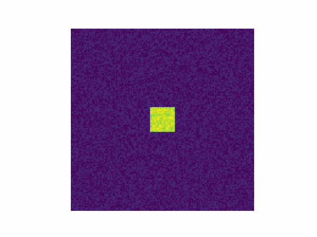

# Diffusion-Reaction-Animations
A notebook that can be used to create matplotlib animations of Gray Scott diffusion reaction processes approximated numerically.

[Here's the notebook](https://colab.research.google.com/drive/1bqkH5WEzcrCvBkUeNleejYPliDPLLsnV?usp=sharing). Create a copy of the notebook, specify animation framerate/resolution and play with the Gray Scott variables to create your own animations.

## Gray Scott Equations
Gray Scott equations describe the rate of change of two co-dependent populations, e.g. one chemical reacting with another to create more of itself or a population of predators whose success depends on the availability of its prey. In the notebook the diffusion rates of each population can be adjusted as well as the kill and feed rate.  
For a more eloquant explenation: [mit.edu](https://groups.csail.mit.edu/mac/projects/amorphous/GrayScott/)
